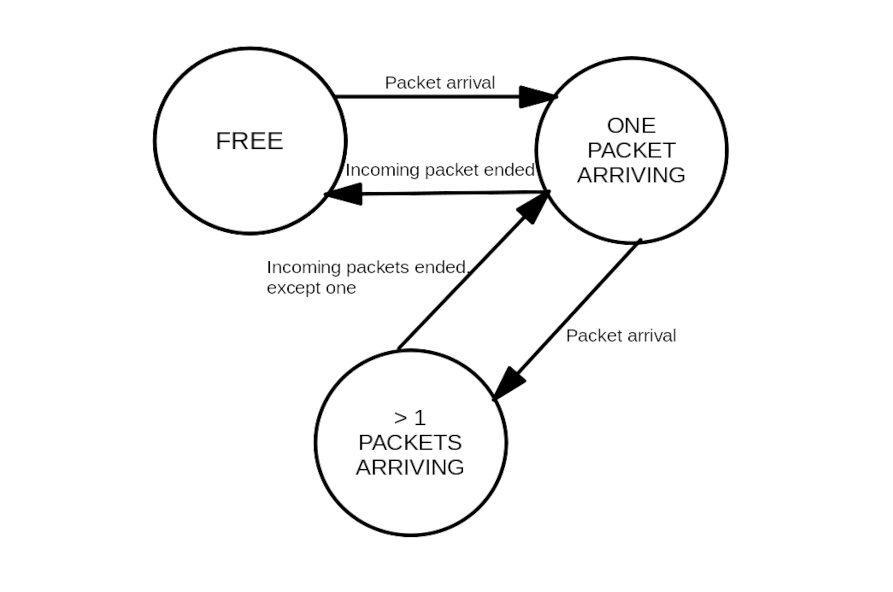
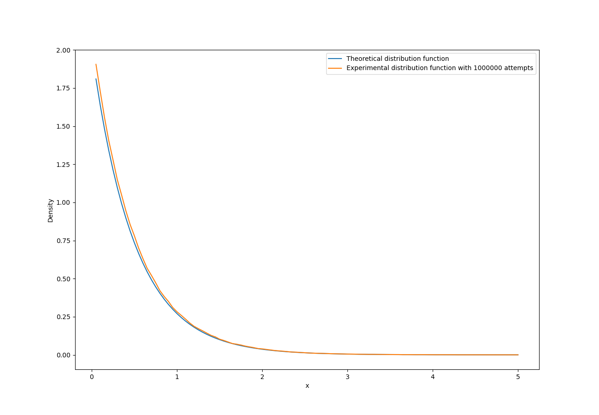
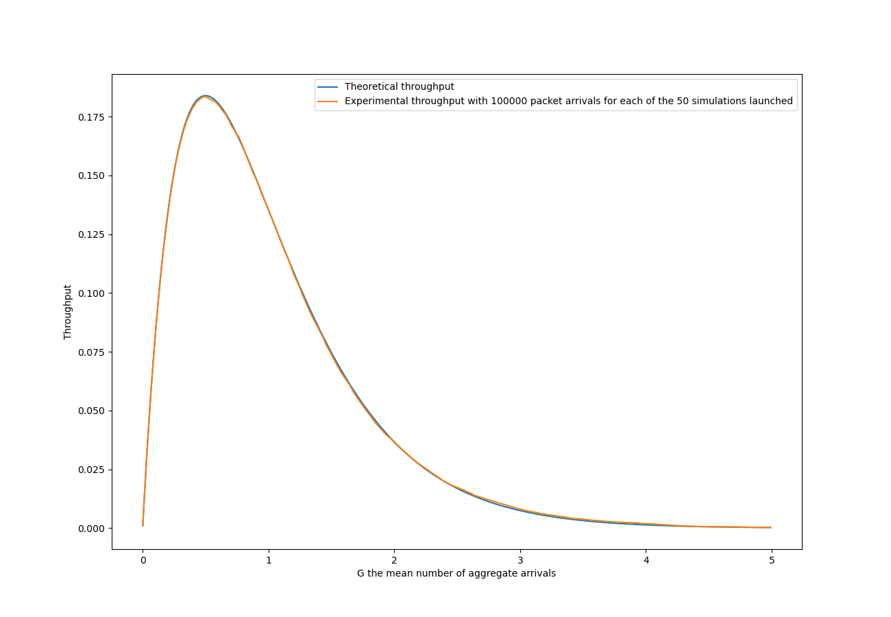
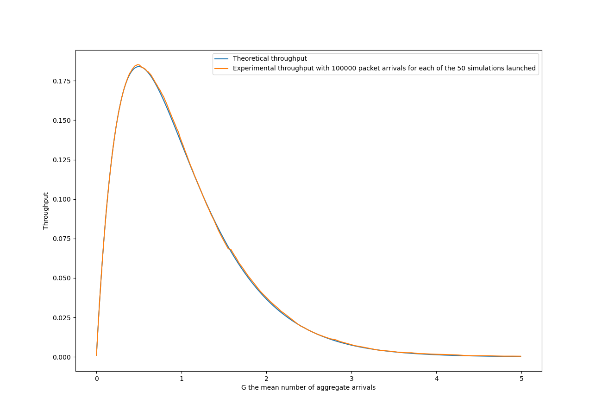

# TD4 PERFORMANCE EVALUATION : A Pure Aloha simulator

## 1. States, events, input parameters

### Overview

Let be a single channel of communication connected to an infinite number of stations that use Pure Aloha to transmit their packets through the channel. We suppose that the arrival time of packets in the channel follows an exponential distribution. We want to experimentally verify the fact that the average throughput according to the mean number of aggregate arrivals G is `G*exp(-2G)`.

### Input parameters :

We try several values of G, the mean number of aggregate arrivals. For each of them we launch a single very long simulation to have a precise estimation of the throughput (percentage of time spent successfully transmitting packets). Therefore in order not to run the simulations during an infinite time, we need a parameter that tell us the number of packets that will arrive to the channel. We arbitrarily chose this parameter to be 100 000, big enough to generate precise simulations, but small enough not to kill my computer.

As briefly mentioned_in the Overview, in the Pure Aloha for a fixed value of G and at every time t, the time interval between t and the next packet arrival follows an exponential distribution of parameter G/(packet duration).

### The Channel object and its states :

In the simulator we implement a Channel class representing the channel to which the stations connect in order to send their packets. It can be in three different states : RECEIVING_ONE, RECEIVING_SEVERAL and FREE. The two first are when the channel is receiving packets from one (resp. several) stations. The last one is when no packet is arriving at the antenna. The Channel class implements the core function `send_packets(s)` that simulates a packet arriving at time s on the channel. It also keep track of the time, the (fixed) packet duration as well as the number of successfully transmitted packets.

### The System object and its events

The System class represents the overall system, that uses the random generator as well as the channel to simulate Pure Aloha. Following our definition of Channel, all System has to do is to initialize the random generator and the channel, send 100 000 packets to the latter (with time intervals following an exponential distribution), and then return the proportion of time spent on successfully transmitting packets.

All in all, the model we use is the following :

## 2. Implementing an exponential distribution random generator

Let's suppose that we have access to an uniform distribution between 0 and 1 random generator. To randomly generate numbers numbers following an exponential distribution of parameter `lambda`, I used the inverse cumulative distribution `g(x) = -log(1-x)/lambda` applied to a uniformly generated random number between 0 and 1.

In order to verify that my implementation works, I generated a million numbers with it, then I created 1000 intervals between 0 and x_max = 5 and calculated, for each of them, the proportion of generated numbers that belong to it. Then I plotted the proportions ; the plot should approximate the theoretical exponential density function `f(x) = lambda * exp(- lambda * x)`. Let's see the results :

## 3. Running the algorithm

Here are the plots got from the simulations. The first one for a packet duration of 1, the second one for 100.

These results are coherent with the theory, and they experimentally confirm the fact that the simulation doesn't depend on the value of the duration of the packets.